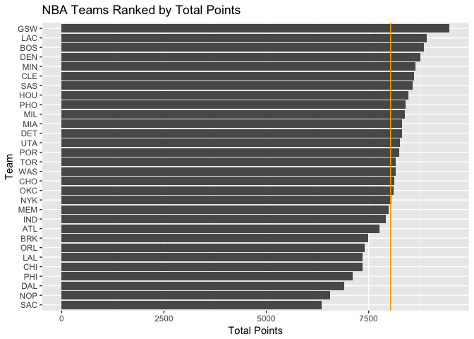

teams\_pca
================
Yoon Sung Hong
10/5/2017

``` r
#loading some of the packages that may be needed for the project
library(readr)
library(dplyr)
```

    ## 
    ## Attaching package: 'dplyr'

    ## The following objects are masked from 'package:stats':
    ## 
    ##     filter, lag

    ## The following objects are masked from 'package:base':
    ## 
    ##     intersect, setdiff, setequal, union

``` r
library(ggplot2)
#setting wd
setwd("~/previous-projects/R-projects/nba_teams_pca/")
#loading data frames
dat <- read.csv("data/nba2017-teams.csv")
str(dat)
```

    ## 'data.frame':    30 obs. of  15 variables:
    ##  $ team        : Factor w/ 30 levels "ATL","BOS","BRK",..: 1 2 3 4 5 6 7 8 9 10 ...
    ##  $ experience  : int  93 63 52 58 66 128 62 74 55 101 ...
    ##  $ salary      : num  90.9 91.9 65.5 92.1 100.2 ...
    ##  $ points3     : int  626 985 738 565 808 1012 754 868 631 982 ...
    ##  $ points2     : int  2254 2183 1950 2162 2102 2107 1803 2347 2638 2540 ...
    ##  $ free_throws : int  1373 1536 1381 1330 1499 1355 1042 1471 1140 1447 ...
    ##  $ points      : int  7759 8857 7495 7349 8127 8605 6910 8769 8309 9473 ...
    ##  $ off_rebounds: int  807 744 608 865 634 727 534 867 908 759 ...
    ##  $ def_rebounds: int  2537 2698 2546 2416 2636 2639 2109 2646 2838 2854 ...
    ##  $ assists     : int  1784 2069 1593 1746 1805 1760 1291 2009 1731 2475 ...
    ##  $ steals      : int  601 617 547 605 550 475 538 538 574 779 ...
    ##  $ blocks      : int  354 341 372 339 320 299 266 285 310 551 ...
    ##  $ turnovers   : int  1136 1037 1152 952 827 1005 703 1097 932 1171 ...
    ##  $ fouls       : int  1329 1686 1522 1275 1198 1318 1280 1458 1467 1565 ...
    ##  $ efficiency  : num  140 148 148 139 145 ...

Ranking of Teams
----------------

``` r
#ranking teams according to salary
dat <- transform(dat, team = reorder(team, salary))
ggplot(data = dat, aes(x = team, y = salary)) + 
  geom_bar(stat = 'identity') + 
  coord_flip() + 
  geom_hline(aes(yintercept = mean(dat$salary)), color = "orange") + labs(title = "NBA Teams Ranked by Total Salary", y = "Salary (in millions)", x = "Team" )
```


``` r
#ranking teams according to total points
dat <- transform(dat, team = reorder(team, points))
ggplot(data = dat, aes(x = team, y = points)) +
  geom_bar(stat = 'identity') + 
  coord_flip() + 
  geom_hline(aes(yintercept = mean(dat$points)), color = "orange") + labs(title = "NBA Teams Ranked by Total Points", y = "Total Points", x = "Team" )
```



``` r
#ranking teams according to efficiency
dat <- transform(dat, team = reorder(team, efficiency))
ggplot(data = dat, aes(x = team, y = efficiency)) + 
  geom_bar(stat = 'identity') + coord_flip() + geom_hline(aes(yintercept = mean(dat$efficiency)),color = "orange") + labs(title = "NBA Teams Ranked by Total Efficiency", y = "Total Efficiency", x = "Team" )
```


### Comments

> It seems to be difficult to find a straight correlation between salary and points, as well as salary and efficiency. There are certain teams with lower total salary who seem to be scoring a lot of points (like Phoenix). However, it is generally clear to say that teams with higher points scored have relatively high efficiencies (although this correlation is not very strong).

Principal Components Analysis (PCA)
-----------------------------------

``` r
#Creating principal components
dat.pca <- select(dat, 
                  c(points3, points2, free_throws,
                    off_rebounds, def_rebounds, assists, 
                    steals, blocks, turnovers, fouls))
pca <- prcomp(dat.pca, scale. = TRUE)
pca
```

    ## Standard deviations (1, .., p=10):
    ##  [1] 2.1669994 1.3046111 0.9897094 0.8784756 0.7308134 0.6913872 0.6182263
    ##  [8] 0.5101592 0.3655034 0.2503921
    ## 
    ## Rotation (n x k) = (10 x 10):
    ##                    PC1         PC2         PC3          PC4         PC5
    ## points3      0.1121782 -0.65652993  0.28806873 -0.042637313  0.28657624
    ## points2      0.3601766  0.32892544 -0.06763180 -0.347710703 -0.15173866
    ## free_throws  0.3227564 -0.17651228  0.39157491  0.147596178 -0.21363792
    ## off_rebounds 0.3029366  0.35931603  0.33884845 -0.288483019 -0.16571824
    ## def_rebounds 0.3719432 -0.12808273  0.15026131 -0.492969442  0.26476256
    ## assists      0.3125312 -0.44134618 -0.26294129 -0.088066602 -0.36972525
    ## steals       0.3447256 -0.03540585 -0.48554101  0.177578661 -0.33549491
    ## blocks       0.3162237  0.06131890 -0.48869371  0.003935374  0.65459381
    ## turnovers    0.3353958 -0.02169833  0.08910421  0.532117541 -0.04471763
    ## fouls        0.3072548  0.28954426  0.26469871  0.454751471  0.26814214
    ##                       PC6         PC7         PC8         PC9         PC10
    ## points3      -0.028435666  0.38167878  0.18027569 -0.20631322  0.409762462
    ## points2      -0.088714347  0.07302430 -0.47216199 -0.35836740  0.499011524
    ## free_throws  -0.487342521 -0.62732220  0.07726675 -0.08283563 -0.006875686
    ## off_rebounds  0.283093235  0.13535335  0.64646479 -0.14735551 -0.124601143
    ## def_rebounds  0.066309015 -0.04926346 -0.23787252  0.64632050 -0.168579984
    ## assists       0.176019008  0.11785039 -0.18235775 -0.34086739 -0.547385461
    ## steals       -0.303664534  0.25883825  0.32703573  0.41596580  0.246739300
    ## blocks       -0.009954065 -0.30799231  0.23947533 -0.27071160 -0.057627209
    ## turnovers     0.675777660 -0.18850849 -0.14308362  0.13524769  0.250947823
    ## fouls        -0.298848473  0.47268121 -0.21462859 -0.04367200 -0.335087245

``` r
#creating a data frame with the eigenvalues
eigs <- data.frame(
  eigenvalue = round(pca$sdev^2, 4),
  prop = round((pca$sdev^2)/(sum(pca$sdev^2)), 4)
)
eigs$cumprop <- cumsum(eigs$prop)
eigs
```

    ##    eigenvalue   prop cumprop
    ## 1      4.6959 0.4696  0.4696
    ## 2      1.7020 0.1702  0.6398
    ## 3      0.9795 0.0980  0.7378
    ## 4      0.7717 0.0772  0.8150
    ## 5      0.5341 0.0534  0.8684
    ## 6      0.4780 0.0478  0.9162
    ## 7      0.3822 0.0382  0.9544
    ## 8      0.2603 0.0260  0.9804
    ## 9      0.1336 0.0134  0.9938
    ## 10     0.0627 0.0063  1.0001

``` r
#PCA scatterplots
pca.plot <- as.data.frame(pca$x)
team <- dat$team
pca.plot <- cbind(pca.plot, team)
ggplot(data = pca.plot, aes(x = PC1, y = PC2)) + geom_text(label = pca.plot$team) + ggtitle("PCA plot (PC1 and PC2)")
```


``` r
#interpreting the PCs 
cor(pca.plot$PC1, dat$off_rebounds)
```

    ## [1] 0.6564635

``` r
cor(pca.plot$PC1, dat$points3)
```

    ## [1] 0.2430901

``` r
cor(pca.plot$PC1, dat$points2)
```

    ## [1] 0.7805026

``` r
cor(pca.plot$PC1, dat$assists)
```

    ## [1] 0.677255

``` r
cor(pca.plot$PC2, dat$points3)
```

    ## [1] -0.8565162

``` r
cor(pca.plot$PC2, dat$off_rebounds)
```

    ## [1] 0.4687677

``` r
cor(pca.plot$PC2, dat$points2)
```

    ## [1] 0.4291198

``` r
cor(pca.plot$PC2, dat$assists)
```

    ## [1] -0.5757851

``` r
#another way to see the significance of the PCs
plot(pca)
```


> It seems to be that points3 variable shows a stronger correlation with PC2 than that of PC1. However, it seems to be that overall, PC1 shows the strongest correlation to different variables. This is also shown by the variance plot shown above.

``` r
#index based on PC1
pca.plot$pc1_rs <- 100*(pca.plot$PC1 - min(pca.plot$PC1))/(max(pca.plot$PC1)-min(pca.plot$PC1))
pca.plot <- transform(pca.plot, team = reorder(team, pc1_rs))
ggplot(data = pca.plot, aes(x = team, y = pc1_rs)) + 
  geom_bar(stat = 'identity') + 
  coord_flip() + 
  labs(title = "NBA Teams Ranked by scaled PC1", y = "First PC (scaled from 0 to 100)", x = "Team" )
```


> As PC1 index represents all variables in consideration from original dataset most significantly of all PCs, we can observe that GSW dominates the NBA in overall statistics and performances over all teams. This indicates that their weakest area has small/no difference in statistics to their strongest area (i.e. they dominate the stats in 3pt shooting, but they also dominate the stats in 2pt shooting and etc). On the other hand, in SAC's case, it can be seen that their almost all their varaibles represented from the dataset has almost no visible difference compared to their weakest area/variable, leading to the inexistent value of scaled PC1 value.
